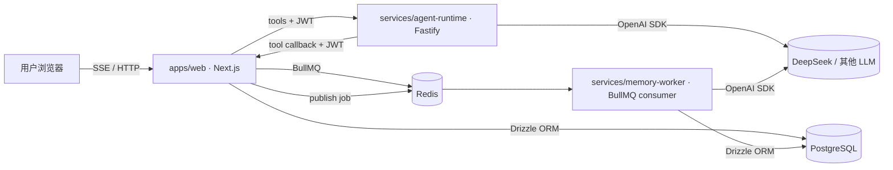
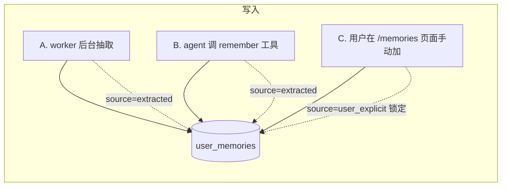
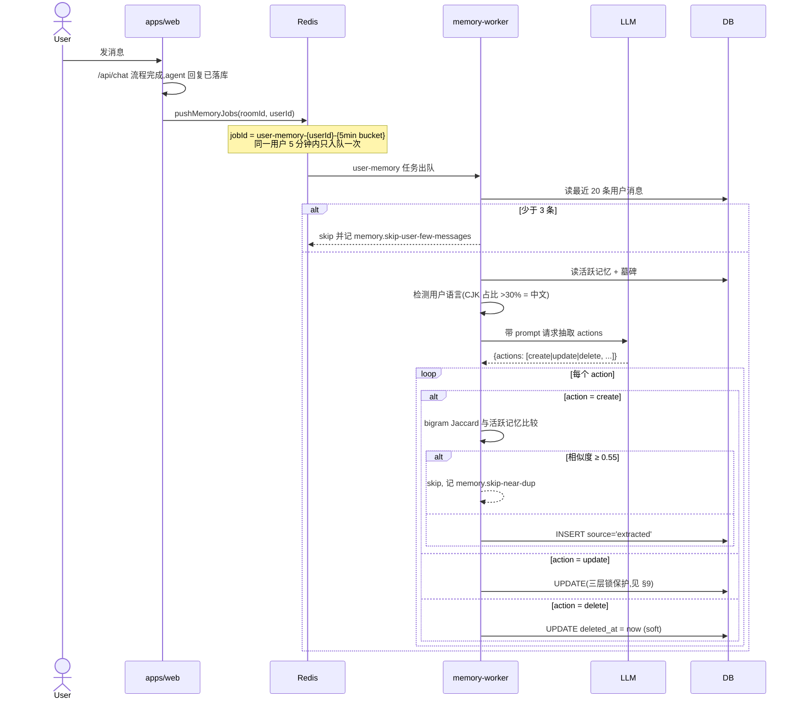
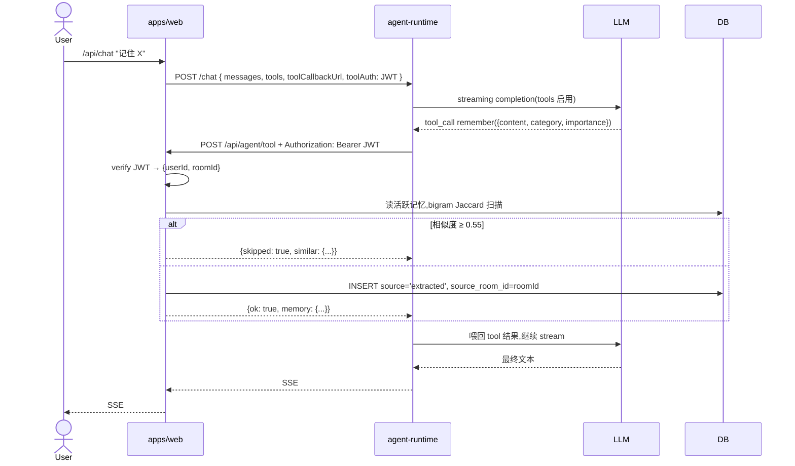
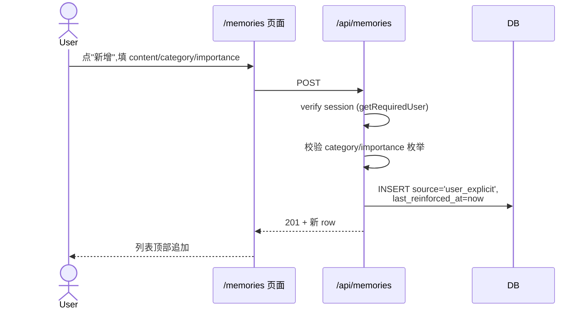
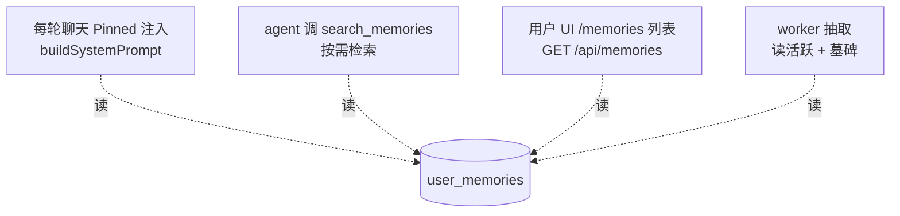
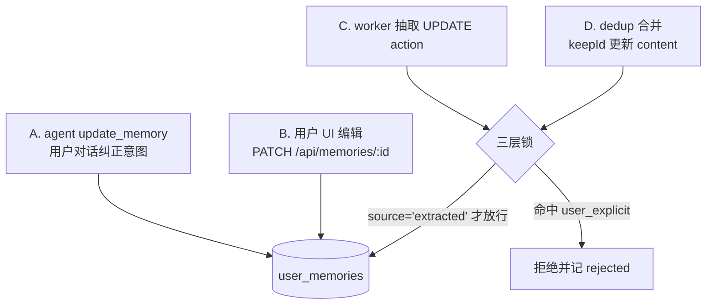
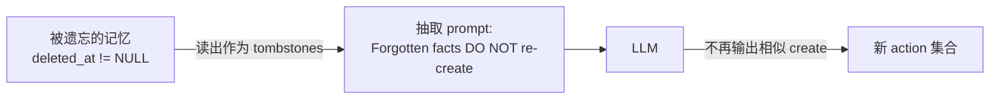
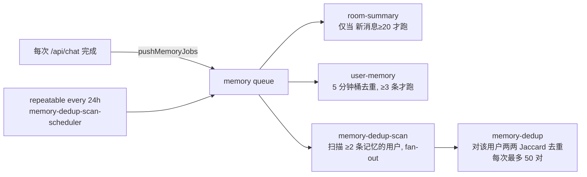
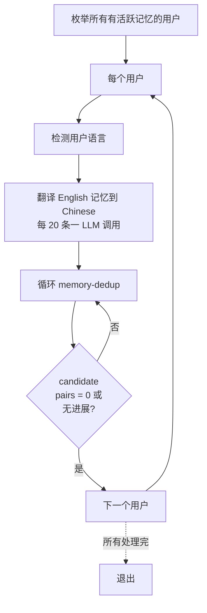

# 记忆系统设计

> **范围**:本项目的长期记忆(long-term memory)实现。covers 写入、查询、更新、遗忘四条路径及其背后的后台任务。
> **不包括**:房间摘要(`room_summaries`)和短期对话上下文(recent messages),那部分在 `apps/web/src/lib/chat/context.ts` 里较为直接,按需参考代码。

---

## 1. 核心概念

- **记忆(memory)**:关于某个用户的单条可跨会话保留的事实,存在 `user_memories` 表。例:`住在深圳` / `喜欢吃辣` / `弟弟叫志龙`。
- **抽取(extraction)**:后台 worker 读用户最近消息,用 LLM 推断应记录/更新/删除哪些 fact。
- **工具(tool)**:agent 在对话里可主动调用的函数(通过 OpenAI tool-calling),包括 `search_memories`、`remember`、`update_memory`、`forget_memory` 等。
- **墓碑(tombstone)**:被遗忘(软删除)的记忆保留在 DB 里用于提示 LLM 不要重新创建。
- **锁定(locked)**:`source='user_explicit'` 的记忆不允许被后台自动流程修改或删除,只能用户自己动。

---

## 2. 数据模型

```sql
user_memories (
  id                 uuid PK,
  user_id            uuid FK users.id,
  content            text,
  category           memory_category,
  importance         memory_importance,
  source             memory_source         -- 'extracted' | 'user_explicit'
  source_room_id     uuid FK rooms.id,
  last_reinforced_at timestamp,
  deleted_at         timestamp,            -- NULL = 活跃, 非 NULL = 墓碑
  created_at, updated_at
);
```

### 枚举

| 字段 | 取值 |
|---|---|
| `category` | `identity` / `preference` / `relationship` / `event` / `opinion` / `context` |
| `importance` | `high` / `medium` / `low` |
| `source` | `extracted`(后台 / agent 产生,可被自动流程修改)/ `user_explicit`(用户明确意图,锁定) |

### 索引(0003 迁移)

- `CREATE EXTENSION pg_trgm`
- 局部 GIN 索引 `messages_content_trgm_idx ON messages USING GIN (content gin_trgm_ops) WHERE status='completed'` — 加速 `search_messages` 工具里的 ILIKE 查询。

---

## 3. 系统拓扑



**关键架构规则**:

- `agent-runtime` **不连 DB**。任何需要访问数据的工具(包括所有记忆工具)通过 HTTP 回调 Next.js 的 `/api/agent/tool`,携带 JWT 里的 `userId/roomId` 声明。
- `memory-worker` 是独立 BullMQ consumer,消费 `memory` 队列,自己连 DB + LLM。
- Next.js 是记忆数据的唯一数据库客户端。

---

## 4. 写入(创建)

### 4.1 三条路径总览



### 4.2 A — worker 后台抽取(最主要来源)



### 4.3 B — agent 调 `remember` 工具



### 4.4 C — 用户 UI 手动添加



---

## 5. 查询(读取)



### 5.1 Pinned 常开注入(每轮对话)

- 入口:`apps/web/src/lib/chat/context.ts` · `getRoomUsersMemories(roomId)`
- 筛选:`deleted_at IS NULL AND (category='identity' OR importance='high')`,**每用户上限 8 条**,按 `importance DESC, updated_at DESC`
- 位置:`buildSystemPrompt` 的 Layer 3 — `"Pinned facts about {name}:"`
- 理由:把最关键的 fact 永远带上;其余靠工具按需查,避免 prompt 膨胀

### 5.2 agent 按需 `search_memories`

```
search_memories({ query?, category?, limit ≤ 30 })
  → ILIKE '%{esc(query)}%' + 可选 category 等值
  → ORDER BY importance DESC, updated_at DESC
```

- JWT 里的 `userId` 决定 scope,参数里任何身份字段**一律忽略**
- pg_trgm GIN 索引加速短字符串匹配;中文按三 n-gram,够用,分词升级是后续工作

### 5.3 UI 列表

`GET /api/memories` → `SELECT * WHERE user_id = session.user.id AND deleted_at IS NULL ORDER BY importance DESC, updated_at DESC`。**没有分页**,MVP 规模(<千条)OK。

### 5.4 worker 抽取时自读

抽取器读活跃记忆按 category 分组,同时读墓碑,一起放进 prompt(墓碑标"DO NOT re-create")。

---

## 6. 更新



**A/B** 一律改 `source='user_explicit'` + `last_reinforced_at=now`:用户的明确操作等于最高真值,以后任何自动流程都不能覆盖。

**C/D** 是自动流程产生的改动,必须走三层锁(§9)。

---

## 7. 遗忘(软删除)

所有遗忘路径都是 **`UPDATE deleted_at = now`**(soft delete),不是 `DELETE FROM`。保留行做**墓碑**用。

```mermaid
flowchart TD
  F1[A. agent forget_memory<br/>用户要求忘掉] --> DB
  F2[B. 用户 UI 点"遗忘"<br/>DELETE /api/memories/:id] --> DB
  F3[C. worker 抽取 delete action] --> Lock{三层锁}
  F4[D. dedup 淘汰较冗余的一条] --> Lock
  Lock -->|source='extracted' 才放行| DB
  DB[(user_memories<br/>deleted_at=now)]
```

**墓碑反馈循环**:



作用:即使用户后续又聊到类似话题,worker 也不会重新创建被遗忘的 fact。

---

## 8. user_explicit 三层防御

锁定(`source='user_explicit'`)的记忆必须禁得住 LLM 偶发乱动作。所有自动 UPDATE/DELETE 路径都叠了三层:

| 层 | 位置 | 作用 |
|---|---|---|
| **Prompt** | `services/memory-worker/src/jobs/user-memory.ts` 的 `EXTRACTION_SYSTEM_PROMPT` | 标注 `[LOCKED]`,明确规则"MUST NOT UPDATE/DELETE" |
| **代码** | 同文件里的 `lockedIds` set | 循环里先检查 id 是否 locked,命中 → rejected++,跳过 |
| **SQL** | UPDATE/DELETE 的 where 子句 `AND source='extracted'` | 即便前两层漏掉,数据库层面就拦住,locked 行永远动不了 |

任何三层之一挡住即可;一起用是保险叠加。

---

## 9. 后台任务与定时

BullMQ `memory` 队列:



手动 CLI(见 §11):

```bash
cd services/memory-worker && pnpm cleanup
```

一次性跑翻译 + 穷举去重,最多 50 轮 per user。

---

## 10. 语言策略

**目标**:新产生的记忆跟随用户的主要语言(中文用户的 fact 用中文)。

**做法**:

1. **抽取侧**(`user-memory.ts`):
   - 用户最近 20 条消息做 CJK 字符占比,>30% 视为中文
   - 把检测到的 language 注入抽取 prompt 顶部,`LANGUAGE (HIGHEST PRIORITY)`
   - prompt 内同时给中英两种示例 fact
2. **工具侧**(`memory-tools.ts` 和 `buildSystemPrompt` 的 tool guidance):
   - `remember` 的 description 明确要求"write in the SAME LANGUAGE the user is using"
   - system prompt 的 TOOL USAGE 段落重申这条
3. **历史治理**:对部署前已经是英文的存量记忆,用 `pnpm cleanup` 批量翻译。

翻译本身也过 LLM(batch size 20,严格 JSON 输出),仅处理 `source='extracted'` 行,`user_explicit` 的绝对不碰。

---

## 11. 批量清理 CLI

`services/memory-worker/src/cli/cleanup.ts`,每个活跃用户串行处理:



可中断(Ctrl+C),已改的不回滚,下次从头再跑是幂等的。单次 LLM 调用超时 90 秒,超时跳过那一批不卡死全局。

---

## 12. 多用户场景的语义

当前的记忆模型是按 1:1 对话设计的。把多个用户(A、B)和同一个 agent 放进一个房间时,各操作的 scope 并不一致,值得显式说明。

### 12.1 当前 scope 矩阵

| 操作 | 作用到谁的记忆 | 为什么 |
|---|---|---|
| **Pinned 常开注入** | **房间内全部成员** | `getRoomUsersMemories(roomId)` 查所有 user member 的 identity+high,按人分组标 "Pinned facts about {name}:" 一起塞进 prompt |
| `search_memories` 工具 | **发话者** | JWT `sub=userId` 锁定,参数里任何身份字段都忽略 |
| `remember` 工具 | **发话者** | 同上,写入 `ctx.userId` 的行 |
| `update_memory` / `forget_memory` | **发话者** | 同上 |
| `/memories` 页面 | **登录用户自己** | session 决定 |
| worker 后台抽取 | **消息发送者** | job 参数 `{userId, roomId}`,抽那个人的最近消息产生其本人的 fact |

关键不对称:**Pinned 注入是全员可见的**(agent 知道房间里都有谁、对每个人的大致印象),但**所有主动读写都是单用户**(只能操作发话者的)。

### 12.2 严格 prompt 规则(当前生效)

为避免 agent 被"A 说 B 喜欢甜食"这种话误导,`buildSystemPrompt` 的 tool guidance 里硬规定:

```
MEMORY WRITING RULES IN GROUP CONVERSATIONS (STRICT):
- 只允许对发话者本人调用 remember / update_memory / forget_memory
- 发话者描述他人时,口头确认,不碰记忆工具
- search_memories 只能查发话者本人
```

实际效果:群聊里 A 说"记住 B 喜欢甜食"→ agent 回复"好的"但 `/api/agent/tool` 没有被调用。要真把这条 fact 存下,得等 B 自己下次发言时再说。

### 12.3 这个模型的哲学含义

当前 `user_memories.user_id` 同时表示 **归属方**(谁的记忆、谁能编辑)和 **主语**(事实是关于谁的)。两者永远相等是一个**简化假设**,群聊下开始不自然。

演进方向(记录在案,不落地):
- 拆出 `subject_user_id`(主语)与 `authored_by_user_id`(谁说的),并引入 subject 确认机制,使"代记"成为可能
- 新增 `room_memories` 表承载房间级共享事实
- 新增 `user_relationships` 表,双向确认的人际关系边

落地路线和对应 schema 设计见顶层计划 `streamed-yawning-pancake` 及后续 CHANGELOG 条目。

---

## 13. 关键风险与取舍

| 风险 | 现状 | 缓解 |
|---|---|---|
| LLM 抽取误判(误 create 重复 / 误 delete) | 前两者靠 bigram 近似去重 + 墓碑拦截;delete 走 soft 有恢复窗口 | worker 和 remember 都加了 ≥0.55 Jaccard 硬拦截 |
| 近义但措辞不同的重复 | bigram 对字面相似敏感,语义相似(如"喜欢甜食" vs "爱吃蛋糕")仍可能产生两条 | D2 规划:embedding + cosine 精确语义去重,需要 pgvector + embedding provider |
| 语言不一致(旧记忆英文、新聊中文) | prompt + 代码侧都强制新记忆语言;历史数据靠 CLI cleanup 批量翻译 | 长期可加"用户语言变更"事件,触发重译 |
| user_explicit 被错改 | 三层锁 | 不能再多了;万一 LLM 产出带错误 memoryId 的 UPDATE/DELETE,SQL predicate 会拦掉 |
| 工具回调鉴权泄漏 | JWT HS256 10 分钟 TTL,`sub=userId`,body 里的 userId/roomId 忽略 | secret 生产环境务必独立轮换 |
| pg_trgm 对中文分词粗 | 三字符 n-gram 够用 MVP | 后续可装 `zhparser` 切到 tsvector 全文索引 |
| 记忆数据全本地,无异地备份 | 单机 docker volume | 定期 `pg_dump` 导出存异地 |

---

## 14. 代码地图

| 模块 | 作用 |
|---|---|
| `packages/db/src/schema.ts` | `user_memories` 表结构 + 枚举 |
| `packages/db/drizzle/0002_*.sql` | source / deleted_at / last_reinforced_at 列 |
| `packages/db/drizzle/0003_messages_trgm_index.sql` | pg_trgm 扩展 + 消息内容 GIN 索引 |
| `apps/web/src/lib/chat/context.ts` | `buildSystemPrompt`、`getRoomUsersMemories`(pinned 注入) |
| `apps/web/src/lib/tools/memory-tools.ts` | 5 个记忆工具的实现与 OpenAI schema |
| `apps/web/src/lib/tool-token.ts` | JWT 签 / 验 |
| `apps/web/src/app/api/agent/tool/route.ts` | 工具分发端点(JWT 验证 + toolRegistry) |
| `apps/web/src/app/api/memories/route.ts` | 用户 UI 的列表 + 新增 |
| `apps/web/src/app/api/memories/[id]/route.ts` | 编辑 + 软删除 |
| `apps/web/src/app/memories/page.tsx` | 记忆管理页面 |
| `services/agent-runtime/src/index.ts` | tool-calling loop,SSE 协议 |
| `services/memory-worker/src/jobs/user-memory.ts` | 后台抽取(create/update/delete + bigram 去重 + 语言检测) |
| `services/memory-worker/src/jobs/memory-dedup.ts` | 去重任务 |
| `services/memory-worker/src/jobs/memory-translate.ts` | 翻译任务 |
| `services/memory-worker/src/cli/cleanup.ts` | 一次性批量清理 CLI |
