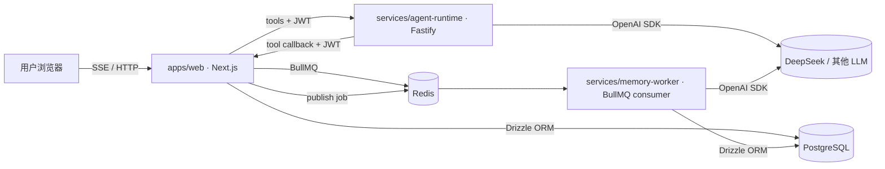
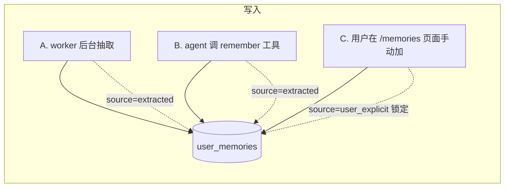
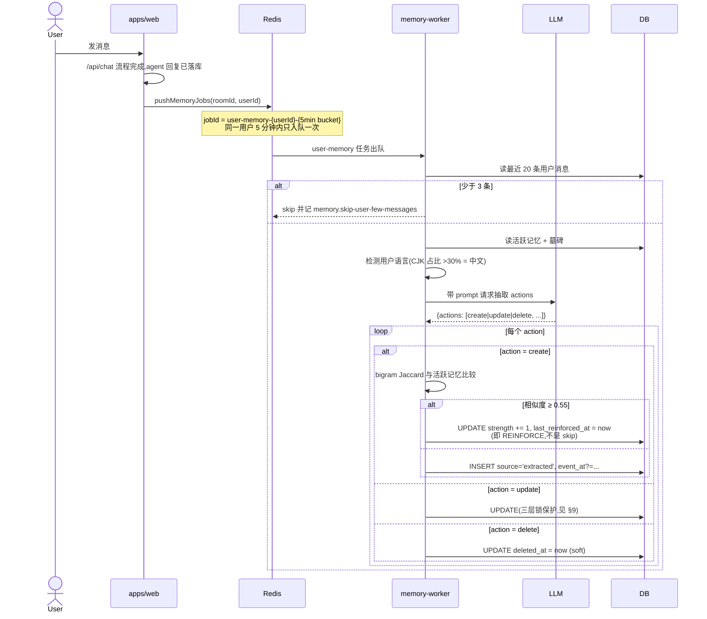
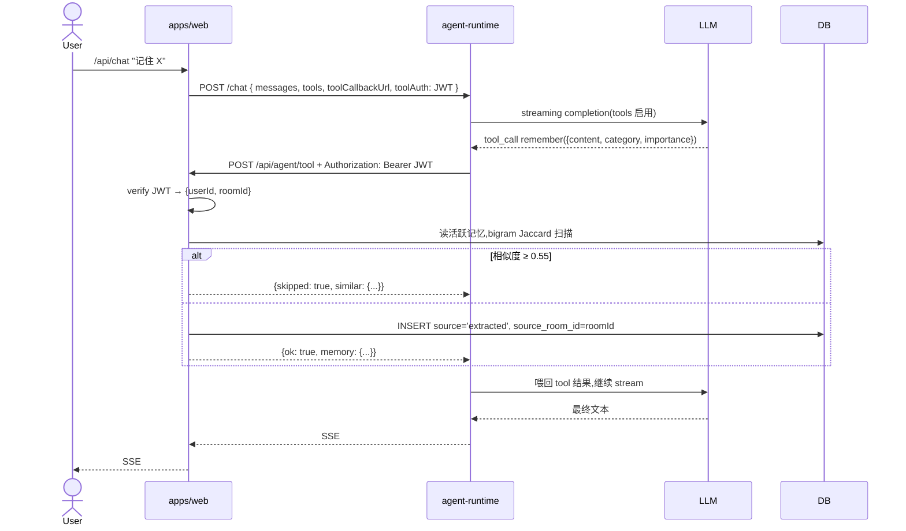
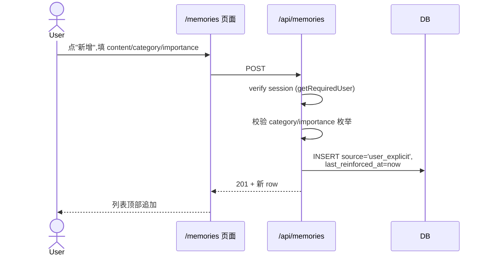
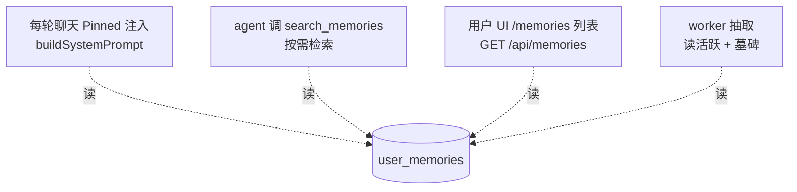
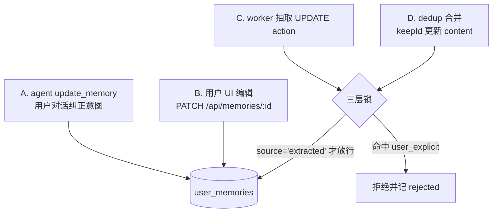
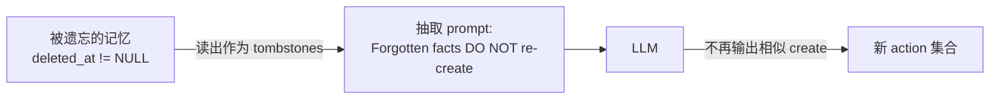
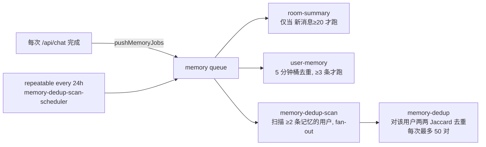
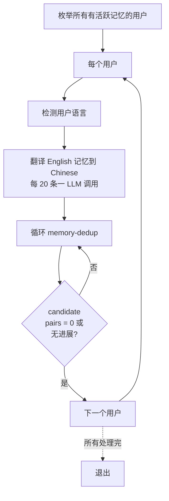

# 记忆系统设计

> **范围**:本项目的长期记忆(long-term memory)实现。covers 写入、查询、更新、遗忘四条路径及其背后的后台任务。
> **不包括**:房间摘要(`room_summaries`)和短期对话上下文(recent messages),那部分在 `apps/web/src/lib/chat/context.ts` 里较为直接,按需参考代码。

---

## 1. 核心概念

- **记忆(memory)**:关于某个用户的单条可跨会话保留的事实,存在 `user_memories` 表。例:`住在深圳` / `喜欢吃辣` / `弟弟叫志龙`。
- **抽取(extraction)**:后台 worker 读用户最近消息,用 LLM 推断应记录/更新/删除哪些 fact。
- **工具(tool)**:agent 在对话里可主动调用的函数(通过 OpenAI tool-calling),包括 `search_memories`、`remember`、`update_memory`、`forget_memory` 等。
- **墓碑(tombstone)**:被遗忘(软删除)的记忆保留在 DB 里用于提示 LLM 不要重新创建。
- **锁定(locked)**:`source='user_explicit'` 的记忆不允许被后台自动流程修改或删除,只能用户自己动。

---

## 2. 数据模型

### 2.1 `user_memories` — 每个"主语"(user)的长期记忆

```sql
user_memories (
  id                   uuid PK,
  user_id              uuid FK users.id,            -- 主语/所有者(关于谁)
  content              text,
  category             memory_category,
  importance           memory_importance,
  source               memory_source,               -- 'extracted' | 'user_explicit'
  source_room_id       uuid FK rooms.id,
  authored_by_user_id  uuid FK users.id,            -- 写入者(NULL 或 = user_id → 自述)
  confirmed_at         timestamp,                   -- subject 接受他人代写的时间
  last_reinforced_at   timestamp,                   -- 最近一次强化/更新时间(decay 的锚)
  event_at             timestamptz,                 -- 事件发生时间(相对时间在写入时解析成绝对时间)
  strength             real NOT NULL DEFAULT 1.0,   -- 强化计数:重复提及 +1
  deleted_at           timestamp,                   -- NULL = 活跃,非 NULL = 墓碑
  created_at, updated_at
);
-- Partial index 0004: user_memories_pending_idx
--   WHERE deleted_at IS NULL AND authored_by_user_id IS NOT NULL AND confirmed_at IS NULL
-- Partial index 0007: user_memories_event_at_idx (user_id, event_at DESC)
--   WHERE deleted_at IS NULL AND event_at IS NOT NULL  -- 时间范围检索
```

### 2.2 `room_memories` — 房间级共享事实(Phase 3)

```sql
room_memories (
  id                   uuid PK,
  room_id              uuid FK rooms.id,
  content              text,
  importance           memory_importance,
  created_by_user_id   uuid FK users.id,
  source               memory_source,
  deleted_at           timestamp,
  created_at, updated_at
);
-- Partial index 0005: room_memories_active_idx
--   ON (room_id, importance, updated_at DESC) WHERE deleted_at IS NULL
```

### 2.3 `user_relationships` — 双向确认的人际关系边(Phase 4)

```sql
user_relationships (
  id                   uuid PK,
  a_user_id            uuid FK users.id,            -- 规范序 a_user_id < b_user_id
  b_user_id            uuid FK users.id,
  kind                 varchar(40),                 -- spouse/family/colleague/friend/custom
  content              text,
  confirmed_by_a       timestamp,
  confirmed_by_b       timestamp,
  deleted_at           timestamp,
  created_at, updated_at,
  CHECK (a_user_id < b_user_id),
  UNIQUE (a_user_id, b_user_id, kind)
);
-- Partial indexes 0006 on a_user_id 和 b_user_id(各自 WHERE deleted_at IS NULL)
```

### 枚举

| 字段 | 取值 |
|---|---|
| `category`(user_memories) | `identity` / `preference` / `relationship` / `event` / `opinion` / `context` |
| `importance` | `high` / `medium` / `low` |
| `source` | `extracted`(后台 / agent 产生,可被自动流程修改)/ `user_explicit`(用户明确意图,锁定) |
| `kind`(user_relationships) | `spouse` / `family` / `colleague` / `friend` / `custom` |

### 索引

- `0003` — `CREATE EXTENSION pg_trgm`;GIN `messages_content_trgm_idx WHERE status='completed'` 加速消息检索
- `0004` — user_memories "待确认" 部分索引
- `0005` — room_memories 活跃部分索引
- `0006` — user_relationships 两侧部分索引
- `0007` — user_memories 增加 `event_at` / `strength` 列 + `user_memories_event_at_idx` 部分索引(时间范围检索)

---

## 3. 系统拓扑



**关键架构规则**:

- `agent-runtime` **不连 DB**。任何需要访问数据的工具(包括所有记忆工具)通过 HTTP 回调 Next.js 的 `/api/agent/tool`,携带 JWT 里的 `userId/roomId` 声明。
- `memory-worker` 是独立 BullMQ consumer,消费 `memory` 队列,自己连 DB + LLM。
- Next.js 是记忆数据的唯一数据库客户端。

---

## 4. 写入(创建)

### 4.1 三条路径总览



### 4.2 A — worker 后台抽取(最主要来源)



**Phase A 关键变化**:
- 抽取 prompt 顶部注入当前时间 + 每条消息带 `[YYYY-MM-DD HH:mm]`,LLM 必须把相对时间(今天/昨天/刚才/上周)解析成绝对日期才能写进 content,且对时间敏感的 fact 同时输出 `eventAt`
- 近似重复触发 REINFORCE 而非 skip,是 §15 动态记忆的核心信号

### 4.3 B — agent 调 `remember` 工具



### 4.4 C — 用户 UI 手动添加



---

## 5. 查询(读取)



### 5.1 Pinned 常开注入(每轮对话)

- 入口:`apps/web/src/lib/chat/context.ts` · `getRoomUsersMemories(roomId)`
- 筛选:`deleted_at IS NULL AND (category='identity' OR importance='high')`,**每用户上限 8 条**
- **排序**(Phase A):按 `strength × importance_weight × exp(-age_days/30)` 动态分数(详见 §15),而不是静态 importance+recency
- 位置:`buildSystemPrompt` 的 Layer 3 — `"Pinned facts about {name}:"`
- 理由:把最关键的 fact 永远带上;其余靠工具按需查,避免 prompt 膨胀

### 5.2 agent 按需 `search_memories`

```
search_memories({ query?, category?, from?, to?, limit ≤ 30 })
  → ILIKE '%{esc(query)}%' + 可选 category 等值
  → 若提供 from/to:WHERE event_at BETWEEN ... AND event_at IS NOT NULL
                   ORDER BY event_at DESC
  → 否则:ORDER BY importance DESC, updated_at DESC
```

- JWT 里的 `userId` 决定 scope,参数里任何身份字段**一律忽略**
- `from` / `to` 是 ISO8601(日期或完整时间戳都行)。带时间参数时只命中有 `event_at` 的行,用 §2 的 `user_memories_event_at_idx` 部分索引
- pg_trgm GIN 索引加速短字符串匹配;中文按三 n-gram,够用,分词升级是后续工作

### 5.3 UI 列表

`GET /api/memories` → `SELECT * WHERE user_id = session.user.id AND deleted_at IS NULL ORDER BY importance DESC, updated_at DESC`。**没有分页**,MVP 规模(<千条)OK。

### 5.4 worker 抽取时自读

抽取器读活跃记忆按 category 分组,同时读墓碑,一起放进 prompt(墓碑标"DO NOT re-create")。

---

## 6. 更新



**A/B** 一律改 `source='user_explicit'` + `last_reinforced_at=now`:用户的明确操作等于最高真值,以后任何自动流程都不能覆盖。

**C/D** 是自动流程产生的改动,必须走三层锁(§9)。

---

## 7. 遗忘(软删除)

所有遗忘路径都是 **`UPDATE deleted_at = now`**(soft delete),不是 `DELETE FROM`。保留行做**墓碑**用。

```mermaid
flowchart TD
  F1[A. agent forget_memory<br/>用户要求忘掉] --> DB
  F2[B. 用户 UI 点"遗忘"<br/>DELETE /api/memories/:id] --> DB
  F3[C. worker 抽取 delete action] --> Lock{三层锁}
  F4[D. dedup 淘汰较冗余的一条] --> Lock
  Lock -->|source='extracted' 才放行| DB
  DB[(user_memories<br/>deleted_at=now)]
```

**墓碑反馈循环**:



作用:即使用户后续又聊到类似话题,worker 也不会重新创建被遗忘的 fact。

---

## 8. user_explicit 三层防御

锁定(`source='user_explicit'`)的记忆必须禁得住 LLM 偶发乱动作。所有自动 UPDATE/DELETE 路径都叠了三层:

| 层 | 位置 | 作用 |
|---|---|---|
| **Prompt** | `services/memory-worker/src/jobs/user-memory.ts` 的 `EXTRACTION_SYSTEM_PROMPT` | 标注 `[LOCKED]`,明确规则"MUST NOT UPDATE/DELETE" |
| **代码** | 同文件里的 `lockedIds` set | 循环里先检查 id 是否 locked,命中 → rejected++,跳过 |
| **SQL** | UPDATE/DELETE 的 where 子句 `AND source='extracted'` | 即便前两层漏掉,数据库层面就拦住,locked 行永远动不了 |

任何三层之一挡住即可;一起用是保险叠加。

---

## 9. 后台任务与定时

BullMQ `memory` 队列:



手动 CLI(见 §11):

```bash
cd services/memory-worker && pnpm cleanup
```

一次性跑翻译 + 穷举去重,最多 50 轮 per user。

---

## 10. 语言策略

**目标**:新产生的记忆跟随用户的主要语言(中文用户的 fact 用中文)。

**做法**:

1. **抽取侧**(`user-memory.ts`):
   - 用户最近 20 条消息做 CJK 字符占比,>30% 视为中文
   - 把检测到的 language 注入抽取 prompt 顶部,`LANGUAGE (HIGHEST PRIORITY)`
   - prompt 内同时给中英两种示例 fact
2. **工具侧**(`memory-tools.ts` 和 `buildSystemPrompt` 的 tool guidance):
   - `remember` 的 description 明确要求"write in the SAME LANGUAGE the user is using"
   - system prompt 的 TOOL USAGE 段落重申这条
3. **历史治理**:对部署前已经是英文的存量记忆,用 `pnpm cleanup` 批量翻译。

翻译本身也过 LLM(batch size 20,严格 JSON 输出),仅处理 `source='extracted'` 行,`user_explicit` 的绝对不碰。

---

## 11. 批量清理 CLI

`services/memory-worker/src/cli/cleanup.ts`,每个活跃用户串行处理:



可中断(Ctrl+C),已改的不回滚,下次从头再跑是幂等的。单次 LLM 调用超时 90 秒,超时跳过那一批不卡死全局。

---

## 12. 多用户语义(Phase 1–4 全部落地)

多用户 + 单 agent 场景下,一条"记忆"实际有多个维度:**关于谁**(subject)、**由谁写入**(author)、**谁能看**(visibility)、**能被哪些自动流程动**(source)。当前系统把它们显式建模在三张表上。

### 12.1 三张表,各管一件事

| 表 | 关心什么 | 归属 | 谁能编辑 |
|---|---|---|---|
| `user_memories` | **关于某个用户的事实** | `user_id`(subject) | subject 本人 + 后台抽取器(受 locked/pending 限制) |
| `room_memories` | **关于房间的事实** | `room_id` | 任一房间成员 |
| `user_relationships` | **两个用户之间的边** | 规范序 `(a_user_id, b_user_id)` | 双方任一侧(但只有双方都 confirm 才生效) |

### 12.2 权威性分级(user_memories)

`authored_by_user_id` 和 `confirmed_at` 一起定义一条记忆的"状态":

```
authored_by_user_id IS NULL                       → self / 系统抽取,自动生效
authored_by_user_id = user_id                     → 等价于上面
authored_by_user_id != user_id,confirmed_at NULL → PENDING(代写,待 subject 接受)
authored_by_user_id != user_id,confirmed_at 非空 → 已接受,与 self 等价
```

共用 WHERE 表达式 `visibleToSubject()`(`apps/web/src/lib/memory-filters.ts`)在所有读路径应用,使 pending 行对 pinned 注入、search_memories、"我的记忆"页面都不可见,直到 subject 接受。

### 12.3 scope 矩阵(更新后)

| 操作 | 作用域 | 说明 |
|---|---|---|
| Pinned `user_memories` 注入 | 房间所有成员的活跃可见行 | 自动过滤 pending + 墓碑 |
| Room context 注入 | 当前房间 | Phase 3 新增层 |
| Known relationships 注入 | 发话者的双向已确认边 | Phase 4 新增层,且对方必须也在当前房间 |
| `search_memories` | 发话者的可见行 | JWT 锁定 subject |
| `remember`(默认) | 写 subject = 发话者 | 自述,自动生效 |
| `remember({ subjectName })` | 写 subject = 房间成员 X | **pending**,X 需在 /memories 待确认 tab 接受 |
| `update_memory` / `forget_memory` | 仅发话者的**可见**行 | pending 行用 confirm/DELETE,不走 update |
| `confirm_memory` | 发话者作为 subject 的 pending 行 | 翻转 `confirmed_at = now()` |
| `save_room_fact` | 当前房间 | 任一成员的 agent 均可调 |
| `forget_room_fact` | `source='extracted'` 的房间事实 | UI 手动加的 `user_explicit` 不受影响,需从 UI 删 |
| `relate({ otherUserName, kind })` | 规范排序后的 edge | 写当前说话者那一侧的 `confirmed_by_*`,另一侧空 |
| `search_relationships` | 双向已确认且涉及发话者的边 | 对方不一定在当前房间也能搜到(但不注入 pinned) |
| `unrelate` | 涉及发话者的任一边 | 双方任一侧均可删 |

### 12.4 prompt 指导(当前版本)

`buildSystemPrompt` 在 TOOLS 段加:

```
MEMORY WRITING IN GROUP CONVERSATIONS:
- The default subject of remember / update_memory / forget_memory is the
  current speaker. If you decide a fact is genuinely about another room
  member, call remember with subjectName set. The write goes into a
  pending queue the subject can accept or reject. Prefer NOT doing this
  unless clearly useful across sessions.
- update_memory / forget_memory can only touch the speaker's own rows.
- search_memories is scoped to the speaker.
```

群聊中 A 说"记住 B 的生日是 12-25" 现在会:
1. agent 决定调 `remember({ subjectName: "B", content: "生日 12-25", ... })`
2. 代码层解析 "B" → userId,写入 `user_id=B, authored_by=A, confirmed_at=NULL`
3. A 再聊天 pinned 里**不会**出现这条(未确认)
4. B 登录 /memories → 待确认 tab 看到 → 接受 → 变成 B 的正式记忆,后续双方 pinned 都带

### 12.5 隐私默认值

- **自述 = 公开到房间**:pinned 注入把所有房间成员的 identity + high 记忆放进 prompt,agent 在对任何人讲话时都能引用
- **他述 = 私有到 subject**:未确认的代写对 LLM 和其他成员完全不可见,subject 有 **接受 / 拒绝** 两种反应,拒绝 = 软删(成为墓碑,worker 也不会重建)
- **room_memories = 公开到房间**:任何成员都能读/写/改/删
- **user_relationships = 双向同意才生效**:只有 `confirmed_by_a IS NOT NULL AND confirmed_by_b IS NOT NULL` 才会被注入

核心约束:**不存在"某人能悄悄改别人记忆"的路径**。所有跨用户写入都要被写入对象明确接受。

---

## 15. 动态记忆(Phase A)

**动机**:单次事件类信息("今天没吃午饭")不应该原样存成静态 fact —— 今天的"今天",一周后就是噪声。同时,反复出现的行为应该自然变强(→ "经常不吃午饭"),很久不再提及的应该自然褪色。

**设计来源**:
- Park et al. 2023 *Generative Agents*:`score = recency × importance × relevance`,retrieve 本身会重置 recency
- MemoryBank (2023):把 Ebbinghaus 遗忘曲线套进 LLM 记忆,`S(t) = exp(-t/strength)`

**当前实现的三条骨架**:

### 15.1 绝对时间化

- 每轮对话 `buildSystemPrompt` 注入 Layer 1b: `Current time: YYYY-MM-DD HH:mm Weekday (Asia/Shanghai)`
- 后台抽取 prompt 顶部注入"当前时间 + 每条消息 `[YYYY-MM-DD HH:mm]` 前缀"
- 硬性规则:content 里**永远不写相对时间**,解析成绝对日期后存储;事件类 fact 同时输出 `eventAt`(ISO,可日可时)

### 15.2 强化(reinforce)替代跳过

| 场景 | 旧行为 | Phase A 行为 |
|---|---|---|
| worker 抽取 CREATE 遇到 ≥0.55 Jaccard 相似活跃记忆 | skip,记日志 `memory.skip-near-dup` | `UPDATE ... SET strength = strength + 1, last_reinforced_at = now()`,记日志 `memory.reinforce` |
| `remember` 工具遇到同类相似记忆 | 返回 `{skipped: true, similar}` | 返回 `{ok: true, reinforced: true, memory}`(locked / pending 行仍走旧 skip 路径) |

`last_reinforced_at` 是后续衰减的锚点。用户越经常提及一件事,strength 越高 + last_reinforced_at 越新 → 在 pinned 排名里越顶。

### 15.3 read-path 动态分数

`apps/web/src/lib/chat/context.ts · MEMORY_SCORE_SQL`:

```
score =   strength
        × (importance='high' → 3, 'medium' → 2, 'low' → 1)
        × exp( -GREATEST(0, now()-COALESCE(last_reinforced_at, updated_at)) / (30 days) )
```

- 半衰期 30 天(`DECAY_HALFLIFE_DAYS`):一条从不被强化的 `medium` 记忆在 30 天后效果减半,90 天后降到约 12%
- `getUserMemories` / `getRoomUsersMemories` 都改用 `ORDER BY score DESC`,上限不变(pinned 每用户 8 条)
- 识别过滤仍然是 `category='identity' OR importance='high'` 入围,分数只决定入围内的排序 —— 避免纯 decay 打压核心身份信息

### 15.4 时间范围检索

`search_memories({ from, to })` 支持 ISO 范围查询,命中时:
- WHERE `event_at IS NOT NULL AND event_at BETWEEN from AND to`
- ORDER BY `event_at DESC`
- 走 0007 的 `user_memories_event_at_idx` 部分索引

`search_messages` 也补了 `after` 参数,与 `before` 对称组成时间窗。

### 15.5 Retrieve reinforces recency

Phase A 落地之初只有写侧强化(用户/agent 重新提到时 `strength += 1`)。Park 原论文还有另一半:**读(retrieve)也 reset recency**。现已补上(2026-04-19):

- `search_memories` 返回结果后,对命中的每条记忆 fire-and-forget `UPDATE ... SET last_reinforced_at = now()`
- 只刷 `last_reinforced_at`,**不碰 `strength`**:strength 计"被声明过几次",retrieval 是另一种信号,只影响 decay 锚点
- 也覆盖 `source='user_explicit'` 行 —— 读取不改 content,刷 timestamp 让用户锁定的重要 fact 也不至于因为"agent 频繁用但用户没再重复"而衰减

效果:agent 频繁查到的 fact(哪怕用户很久不再主动提)在 pinned 排序里自动保持靠前。

### 15.6 未落地(Phase B+ 规划)

- **Consolidation**:定期扫同 user / `category='event'` / content 相似 / event_at 分散的记忆簇(≥3 条),LLM 判是否能提炼出更高阶语义 fact("经常不吃午饭"),原 event 保留作证据
- **Pinned 阈值硬截断**:score < 阈值时不注入(现在只是排序靠后,受上限 8 保护)
- **Tune 参数**:30 天半衰期 / importance_weight {3,2,1} 都是 MVP 拍脑袋,跑一段时间收真实数据再调

---

## 13. 关键风险与取舍

| 风险 | 现状 | 缓解 |
|---|---|---|
| LLM 抽取误判(误 create 重复 / 误 delete) | 前两者靠 bigram 近似去重 + 墓碑拦截;delete 走 soft 有恢复窗口 | worker 和 remember 都加了 ≥0.55 Jaccard 硬拦截 |
| 近义但措辞不同的重复 | bigram 对字面相似敏感,语义相似(如"喜欢甜食" vs "爱吃蛋糕")仍可能产生两条 | D2 规划:embedding + cosine 精确语义去重,需要 pgvector + embedding provider |
| 语言不一致(旧记忆英文、新聊中文) | prompt + 代码侧都强制新记忆语言;历史数据靠 CLI cleanup 批量翻译 | 长期可加"用户语言变更"事件,触发重译 |
| user_explicit 被错改 | 三层锁 | 不能再多了;万一 LLM 产出带错误 memoryId 的 UPDATE/DELETE,SQL predicate 会拦掉 |
| 工具回调鉴权泄漏 | JWT HS256 10 分钟 TTL,`sub=userId`,body 里的 userId/roomId 忽略 | secret 生产环境务必独立轮换 |
| pg_trgm 对中文分词粗 | 三字符 n-gram 够用 MVP | 后续可装 `zhparser` 切到 tsvector 全文索引 |
| 记忆数据全本地,无异地备份 | 单机 docker volume | 定期 `pg_dump` 导出存异地 |

---

## 14. 代码地图

| 模块 | 作用 |
|---|---|
| `packages/db/src/schema.ts` | `user_memories` 表结构 + 枚举 |
| `packages/db/drizzle/0002_*.sql` | source / deleted_at / last_reinforced_at 列 |
| `packages/db/drizzle/0003_messages_trgm_index.sql` | pg_trgm 扩展 + 消息内容 GIN 索引 |
| `packages/db/drizzle/0007_memory_temporal.sql` | event_at + strength 列 + 事件时间范围索引 |
| `apps/web/src/lib/chat/context.ts` | `buildSystemPrompt`、`getRoomUsersMemories`(pinned 注入)、`MEMORY_SCORE_SQL`(decay 排序) |
| `apps/web/src/lib/tools/memory-tools.ts` | 5 个记忆工具的实现与 OpenAI schema |
| `apps/web/src/lib/tool-token.ts` | JWT 签 / 验 |
| `apps/web/src/app/api/agent/tool/route.ts` | 工具分发端点(JWT 验证 + toolRegistry) |
| `apps/web/src/app/api/memories/route.ts` | 用户 UI 的列表 + 新增 |
| `apps/web/src/app/api/memories/[id]/route.ts` | 编辑 + 软删除 |
| `apps/web/src/app/memories/page.tsx` | 记忆管理页面 |
| `services/agent-runtime/src/index.ts` | tool-calling loop,SSE 协议 |
| `services/memory-worker/src/jobs/user-memory.ts` | 后台抽取(create/update/delete + bigram 去重 + 语言检测) |
| `services/memory-worker/src/jobs/memory-dedup.ts` | 去重任务 |
| `services/memory-worker/src/jobs/memory-translate.ts` | 翻译任务 |
| `services/memory-worker/src/cli/cleanup.ts` | 一次性批量清理 CLI |
